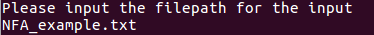
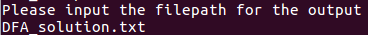

# NFA to DFA Converter

## Description

A simple, efficient, and thoroughly commented C++ program that converts a given NFA with epsilon movements to an equivalent DFA.

## Usage

After downloading, run `make` in the downloaded directory.

After running it, you will find the executable 'regex_conversion.out'. To run it, execute the command `./regex_conversion.out`.

It will then ask you to input two strings:

1. The path of the input file. An example of a valid input is: `regex_example.txt`.

    

2. The path of the output file. An example of a valid input is: `DFA_solution.txt`.

    

You will then see the message `Output written successfully!` if the execution was successful.

## Input file format

The input file should be as follows (each part should be written with a newline character):

1. __State amount__: The number of states the automata has. An example of a valid input is `10`. 
    * The actual states will be considered to start at 0.
    * If you have 10 states, then the states would range from 0 to 10.
    * The NFA initial state will always be considered to be 0.

2. __Final states amount__: The amount of final states the NFA has. For example: `1`.

3. __Final states__: The actual final states, listed one per line. For example `9`.

4. __Transition amount__: The amount of transitions that will be specified for the NFA. For example `12`.
 
5. __Transitions__: One per line. Each transition will be specified as follows (elements separated by whitespaces):
    1. Initial node
    2. Final node
    3. Symbol
    
    An epsilon movement should be specified with the character `~`.
    
    Examples of valid transitions are as follows:
    
   1. 0 1 ~
   2. 0 3 ~
   3. 1 2 a 

There is also an example of this file format in the `NFA_example.txt` file in the project directory.    

## Output

The output will be written in the specified path and will have the same format as the input file.

## Author
 
Axel Zuchovicki - ITESM CSF
