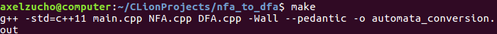
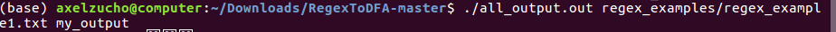
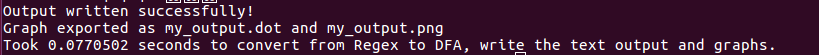

# Regex to DFA Converter

## Description

A simple, efficient, and thoroughly commented C++ program that converts a given regex to an equivalent DFA with the option to draw it.

## Usage

Before starting, make sure you have graphviz and boost intalled.  If not, run `sudo apt-get install graphviz` and `sudo apt-get install libboost-dev` respectively.

After downloading, run `make all` in the downloaded directory.

After running it, you will find three executables:
1. 'no_output.out': This executable will only convert the Regex to a DFA but doesn't have output.
2. 'text_output.out': This executable will convert the Regex to a DFA and output a text file with the expected DFA.
3. 'all_output.out': This executable will convert the Regex to a DFA, output a text file with the expected DFA and graph both the equivalent NFA and DFA.

We will show an example of how to run the third listed executable; with all outputs.

To run it, use the following command inside the downloaded directory:
`./all_output.out [input_file_path] [output_file_path]`

For example, with the first Regex example:

`./all_output.out regex_examples/regex_example1.txt my_output`

You will then see several outputs in the console, including the time it took to execute the program.

After that, you will be prompted to add a string to check if it is part of the generated language; you can input any string as so:

Then you can just type `exit` to stop the program.

## Input regex format

The input file format should be a well formed regex with the character '~' denoting epsilon.
Whitespaces would count as characters, so don't put any whitespaces if not needed.
The following are valid operators and won't be considered as part of the alphabet:
* '|' : OR operator
* '*' : Star operator
* '(' : Grouping (should be matched with the closed brackets)
* ')' : Closing the group.
* '.' : This character isn't supported in graphing, but it would still generate the correct DFA to evaluate. In the example4 for floating numbers, we are using the character ',' instead to be able to graph the result.

There are several examples of this format in the `regex_examples/` directory.

## Output text file format

The output text file would be as follows (each part wll be written with a newline character):

1. __State amount__: The number of states the automata has. An example of a valid input is `10`.
    * The actual states will be considered to start at 0.
    * If you have 10 states, then the states would range from 0 to 10.
    * The NFA initial state will always be considered to be 0.

2. __Final states amount__: The amount of final states the NFA has. For example: `1`.

3. __Final states__: The actual final states, listed one per line. For example `9`.

4. __Transition amount__: The amount of transitions that will be specified for the NFA. For example `12`.

5. __Transitions__: One per line. Each transition will be specified as follows (elements separated by whitespaces):
    1. Initial node
    2. Final node
    3. Symbol
    
It will be saved in the provided output with the ".txt" string appended.

## Output graphs

The output graphs will be in the provided output path and for both NFA and DFA representation of the given Regex.
There are also examples of this output in the `example_outputs` directory.

The NFA graph will be saved in the provided output path with "_NFA.png" appended. 
The DFA graph will be saved in the provided output path with "_DFA.png" appended.

In the NFA representation, the `~` character represents the epsilon movements.

## Authors

Axel Zuchovicki - ITESM CSF
Kevin Woo - ITESM CSF
Eric 'el Michael' Parton - ITESM CSF
